## Project Definition
* ReadingIsGood is an online books retail firm which operates only on the Internet. 
* Main target of ReadingIsGood is to deliver books from its one centralized warehouse to their customers within the same day. 
* That is why stock consistency is the first priority for their vision operations.

## Prerequisites
- Java 11
- [Spring Boot](https://spring.io/projects/spring-boot)
- [Maven](https://maven.apache.org/guides/index.html)
- [Docker](https://www.docker.com/)  
- [Mongo DB](https://docs.mongodb.com/guides/)
- [Lombok](https://objectcomputing.com/resources/publications/sett/january-2010-reducing-boilerplate-code-with-project-lombok)

## Reference Documentation

### Swagger

Postman Collection Added (reading-is-good.postman_collection.json)
<br>

<div style="width:600px;">

  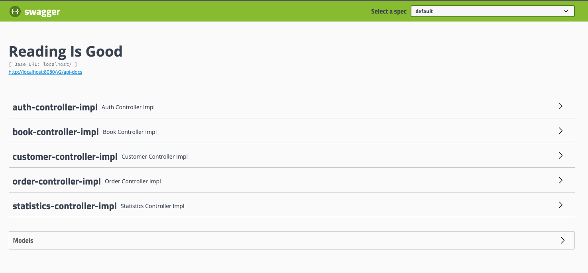

</div>
<div style="width:600px;">

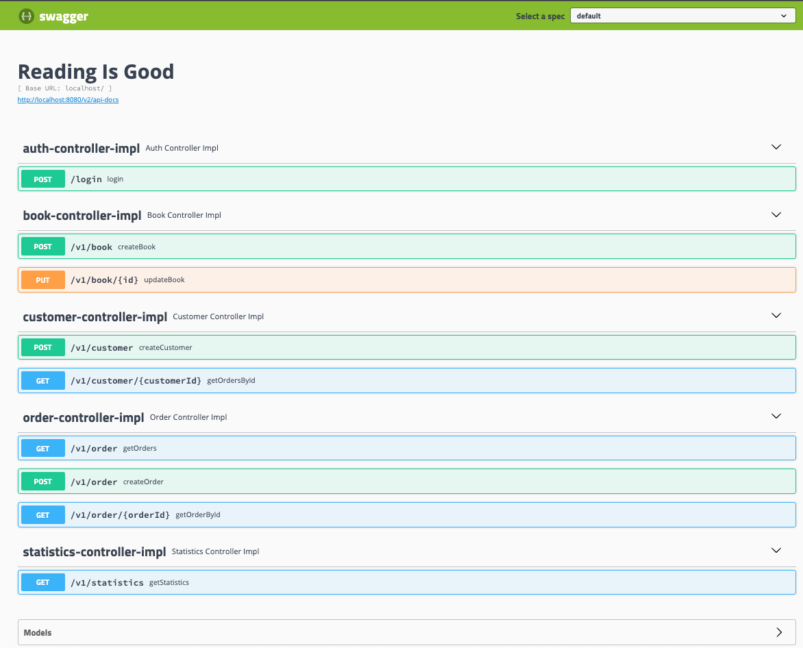

</div>

## Tools
- Eclipse or IntelliJ IDEA (or any preferred IDE)
- Maven 
- Postman (or any RESTful API testing tool)


###  Build and Run application
> Run db first `docker run -d -p 27017:27017 --name mongodb mongo:latest`

> Then run the app `docker run -p 8080:8080 --name reading-is-good --link mongodb:mongo -d reading-is-good:1.0`

or

> Run compose file `docker-compose -f /src/main/resources/docker-compose.yml up
`


## API Endpoints

- ### Authentication
  > **POST Mapping** http://localhost:8080/login  - Get Token
  > 
      Request Body  
      ```
        {
          "username": "isgood",
          "password":"reading"
        }
      ```
- ### Book
  > **POST Mapping** http://localhost:8080/v1/book  - Create Book
  >
      Request Body  
      ```
        {
            "price":32.50,
            "name":"Animal Farm",
            "author":"George Orwell"
        }
      ```

  > **PUT Mapping** http://localhost:8080/v1/book/{id}  - Update Book Stock
  >
      Request Body  
      ```
        {
            "amount":100
        }
      ```
  
- ### Customer
  > **POST Mapping** http://localhost:8080/v1/customer  - Create Customer
  >
      Request Body  
      ```
        {
            "name":"Name",
            "surname":"Surname",
            "email":"email@gmail.com",
            "phone":"5000000000"
        }
      ```
  > **GET Mapping** http://localhost:8080/v1/customer/{id}?pageNumber={pageNumber}&pageSize={pageSize} - Get Orders Of Customer (With Paging)
  > 

- ### Order
  > **POST Mapping** http://localhost:8080/v1/order  - Create Order
  >
      Request Body  
      ```
          {
              "bookId": 1,
              "customerId": 1,
              "amount": 1
          }
      ```
  
  > **GET Mapping** http://localhost:8080/order/{id}  - Get Order By Id
  >
  
  > **GET Mapping** http://localhost:8080/v1/order?startDate={startDate}&endDate={endDate}  - Get Orders Between Dates
  >

- ### GetStatistics
  > **GET Mapping** http://localhost:8080/v1/statistics  - Get Statistics
  >

## ScreenShots

|   |   |   |
|---|---|---|
|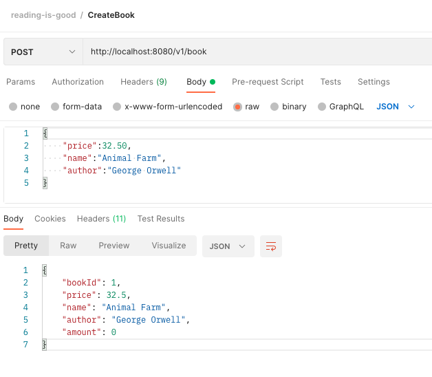| 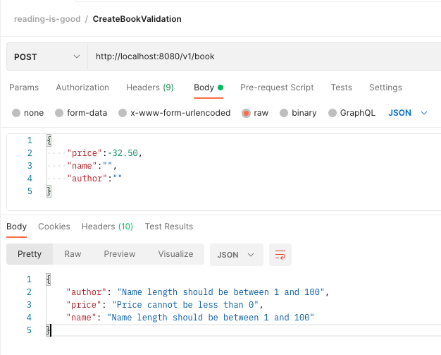 |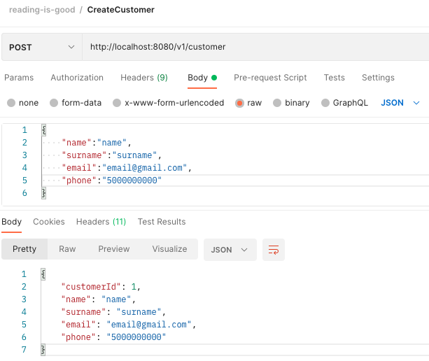 |
|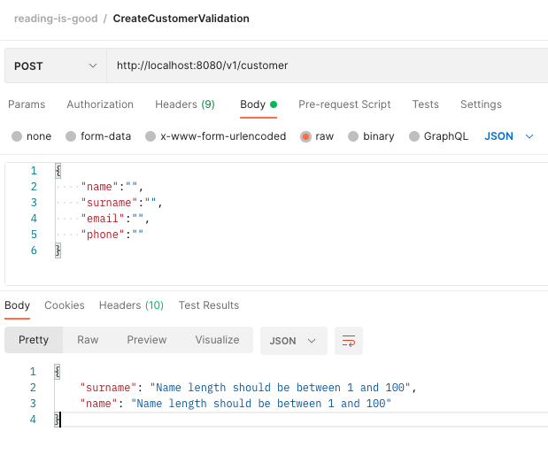| 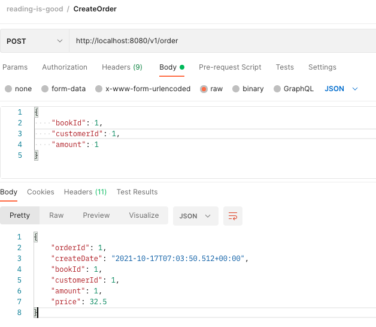 |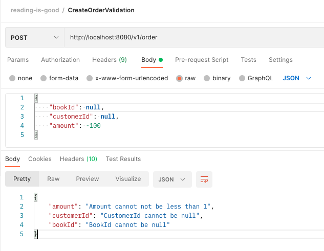 |
|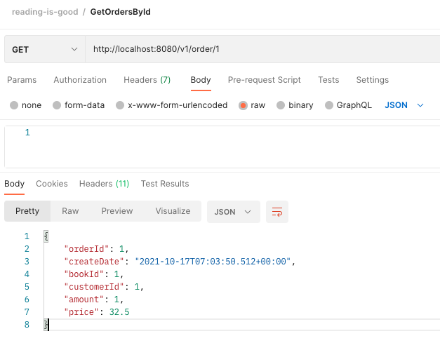| 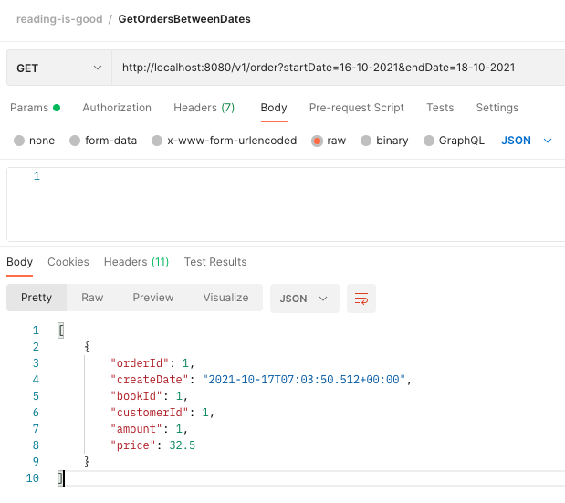 |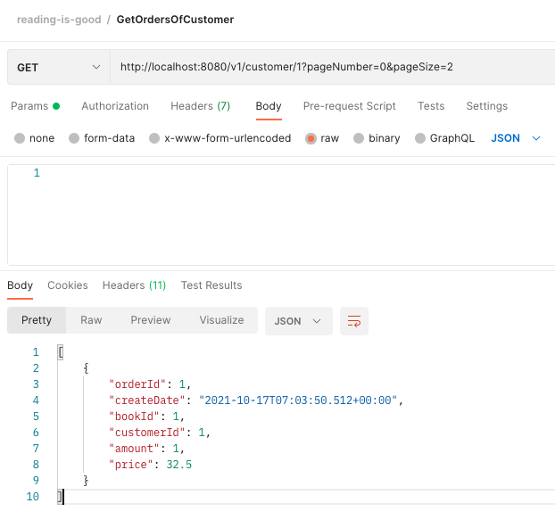 |
|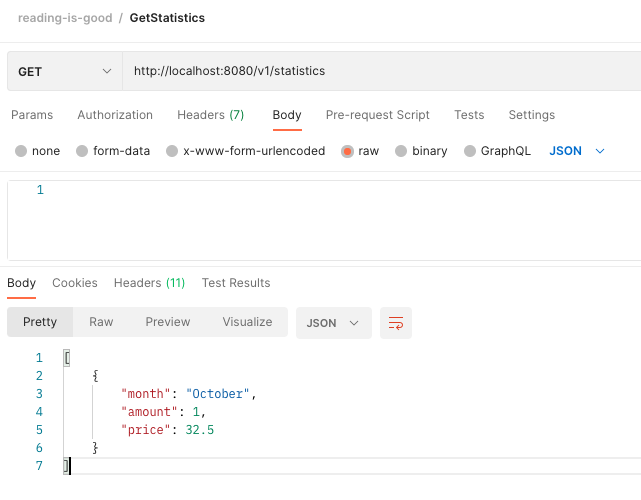| 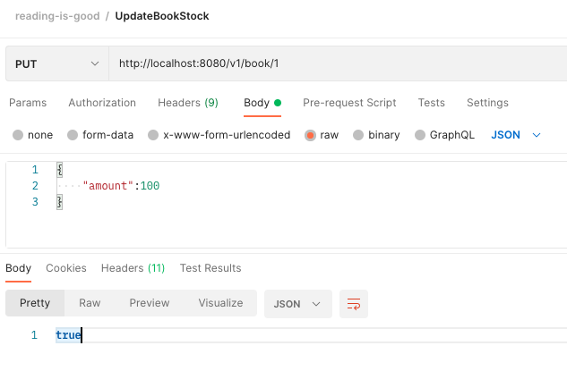 |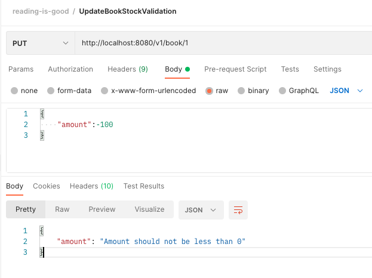 |


